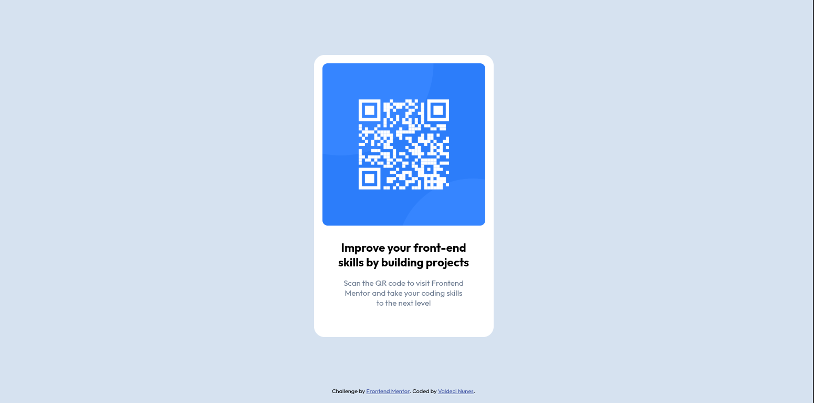

# QR Code Component

Este é um desafio do **Frontend Mentor** que consiste em criar um componente de QR Code responsivo e estilizado utilizando HTML e CSS.

## 📌 Descrição

O projeto exibe um cartão contendo um QR Code e um texto explicativo. O objetivo é aprimorar as habilidades de HTML e CSS, além de praticar o uso de estilização moderna com **Flexbox**.

## 🚀 Tecnologias Utilizadas

- HTML5
- CSS3
- Google Fonts (Outfit)
- Flexbox para centralização

## 🎨 Estilização

A estilização segue um design minimalista, com as seguintes características:

- Fundo com cor suave: `hsl(212, 45%, 89%)`
- Cartão branco com bordas arredondadas
- QR Code com cantos arredondados
- Fonte principal: **Outfit**

## 📷 Captura de Tela

