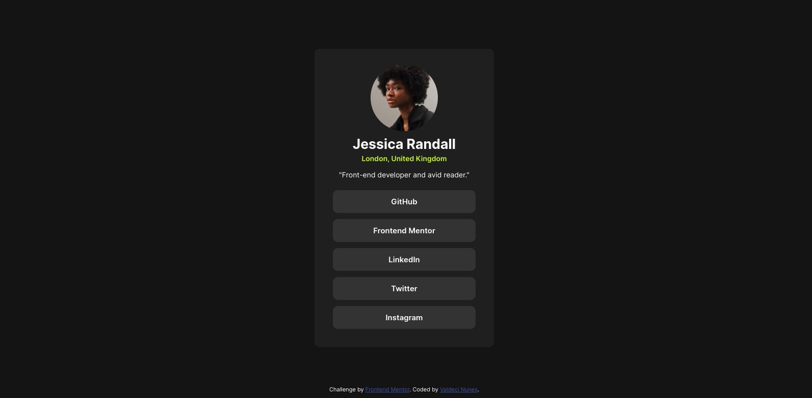

# 🚀 Social Links Profile

Este é um desafio do **Frontend Mentor**, onde o objetivo é criar um **cartão de perfil com links sociais** seguindo um design pré-definido.

## 🎯 Objetivo

Criar um **perfil minimalista** e responsivo, contendo:
- Foto do usuário.
- Nome e localização.
- Descrição profissional.
- Botões com links para redes sociais.

---

## 🖼️ **Resultado do Projeto**

---

## 🛠️ **Tecnologias Utilizadas**
- **HTML5** 🏗️
- **CSS3 (Flexbox & Responsividade)** 🎨

---

## 📌 **Funcionalidades**
✅ Layout responsivo para diferentes dispositivos 📱💻  
✅ Efeito hover nos botões de redes sociais 🔥  
✅ Footer fixo no final da página  

---

## 🎨 **Estilização**
- A estrutura do **layout** foi centralizada usando **Flexbox**.
- A cor do fundo e dos botões segue o design original do desafio.
- O efeito de hover nos botões utiliza **transição suave** para uma melhor experiência do usuário.

---

## 📱 **Responsividade**
Para garantir que o design funcione bem em **dispositivos menores (ex: <370px de largura)**, foram utilizados **@media queries** no CSS.

